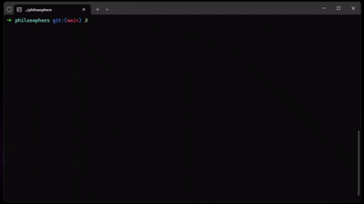

# philosophers

## 💡 Overview
**philosophers** is a project from [42 Lisboa](https://www.42lisboa.com) that simulates the classic **Dining Philosophers problem** using **multithreading** in C.  
The goal is to reinforce understanding of **threads**, **mutexes**, and **synchronization** to avoid **deadlocks** and **race conditions**.

---

## Key Concepts
- Creating and managing threads (`pthread_create`, `pthread_join`)  
- Using mutexes for shared resources (`pthread_mutex_t`)  
- Synchronization and deadlock prevention  
- Time management for actions (eating, sleeping, thinking)  
- Proper memory management and program termination  

---

## Compilation / Installation
```bash
git clone https://github.com/martimsaunders/philosophers.git
cd philosophers
make
```
This will generate the executable:
```bash
./philo
```

## Usage
```bash
./philo number_of_philosophers time_to_die time_to_eat time_to_sleep [number_of_times_each_philosopher_must_eat]
./philo 5 800 200 200
```

<p align="center">
  
</p>

### Parameters
- `number_of_philosophers` → total philosophers
- `time_to_die` → maximum time (ms) a philosopher can go without eating
- `time_to_eat` → time (ms) it takes to eat
- `time_to_sleep` → time (ms) to sleep
- `[number_of_times_each_philosopher_must_eat]` → optional parameter

---

## Tech Stack
- C
- POSIX Threads (pthread)
- Mutexes for synchronization
- UNIX system calls (`gettimeofday`, `usleep`)
- Makefile

---

## Challenges / Lessons Learned
- Managing multiple threads and shared resources safely
- Preventing deadlocks and race conditions
- Implementing precise timing for actions
- Handling program termination gracefully
- Debugging complex multithreaded scenarios

---

Author

- Martim Prazeres Saunders
